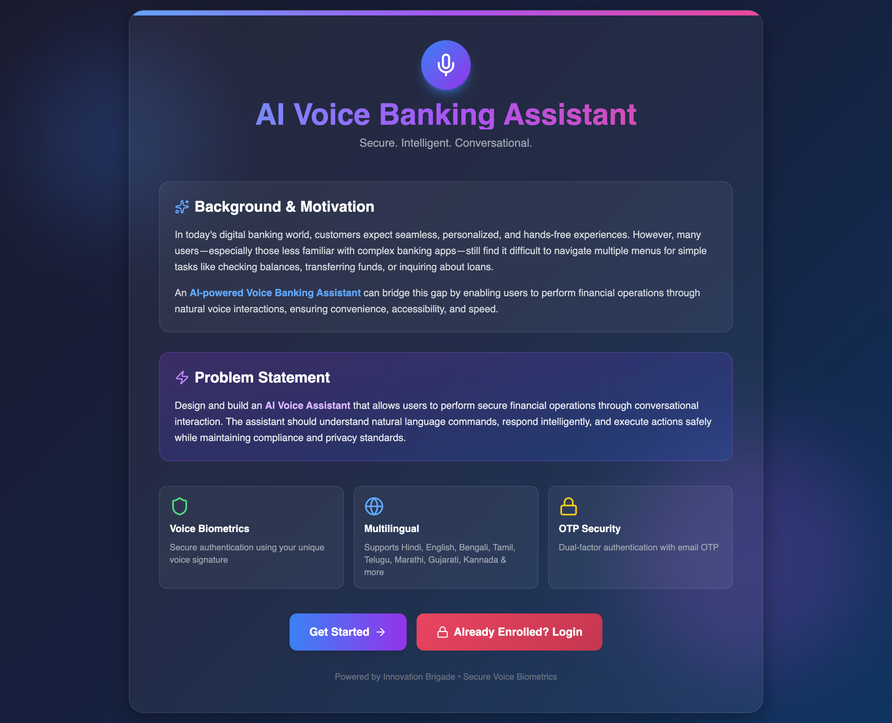
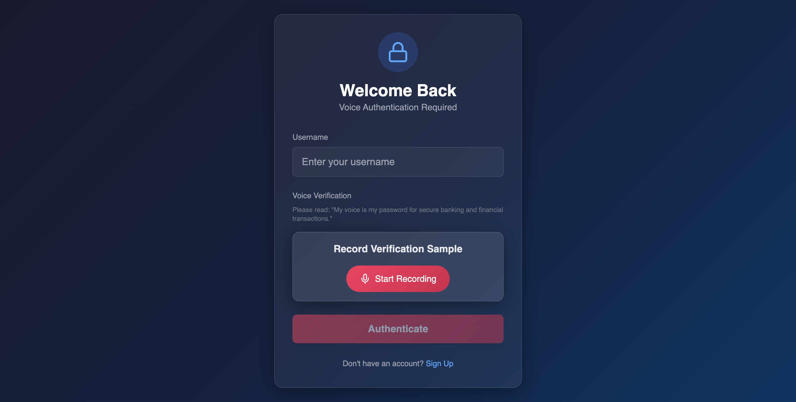
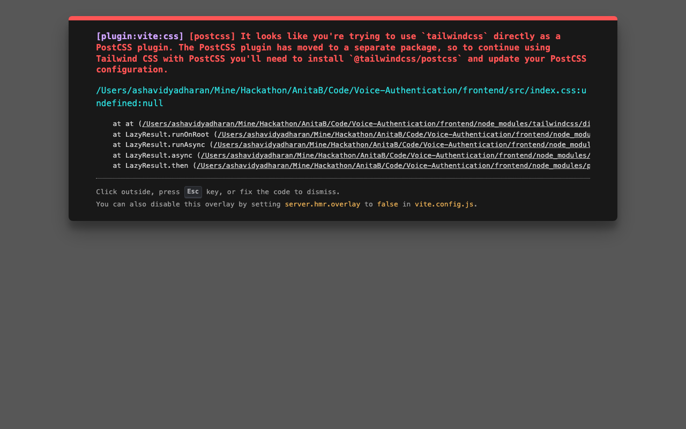
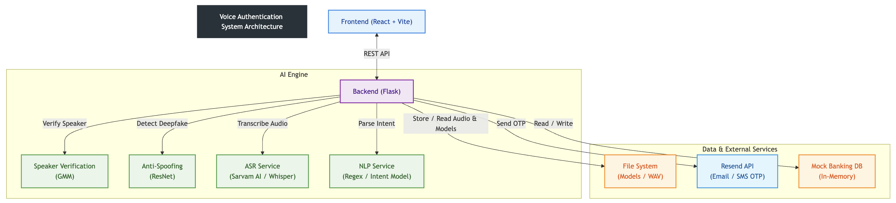

# 🎙️ AI Voice Banking Assistant

[](https://www.python.org/)
[](https://reactjs.org/)


> **"My voice is my password."**  
> A secure, multilingual, and hands-free banking experience powered by advanced Voice Biometrics and AI.

---

## 🌟 Overview

The **AI Voice Banking Assistant** revolutionizes digital banking by enabling users to perform financial operations through natural voice interactions. Designed for accessibility and security, it bridges the gap for users unfamiliar with complex banking interfaces.

### 🚀 Key Features

*   **🔐 Voice Biometric Authentication**: Secure login using your unique voice print (GMM-UBM Models).
*   **🛡️ Dual-Factor Security**: Voice Auth + Email OTP (via Resend API) for maximum protection.
*   **🗣️ Multilingual Support**: Speaks and understands **English, Hindi, Spanish, and French** (powered by Sarvam AI).
*   **🤖 AI-Powered NLP**: Understands natural commands like *"Transfer ₹5000 to Mom"* or *"Check my balance"*.
*   **🕵️ Anti-Spoofing**: Deepfake detection (ResNet/CNN) to prevent replay attacks and synthetic voice fraud.
*   **🎨 Glassmorphism UI**: A stunning, modern interface designed for the next generation of banking.

---

## 📸 Project Screenshots

| **Landing Page** | **Secure Login** |
|:---:|:---:|
|  |  |
| *Modern Landing Page with Glassmorphism* | *Voice Verification with Waveform* |

| **Voice Enrollment** |
|:---:|
|  |
| *10-Sample Voice Enrollment Process* |

---

## 🏗️ System Architecture

The system follows a modular **Client-Server Architecture** designed for separation of concerns and scalability.





1.  **Frontend**: A responsive SPA built with React and Tailwind CSS. It handles audio recording (using MediaRecorder API), visualizes audio waveforms, and communicates with the backend via Axios.
2.  **Backend**: A Flask-based REST API that orchestrates authentication, voice processing, and banking logic.
3.  **AI Engine**: A suite of integrated models for biometrics, security, and language processing.

---

## 🛠️ Technology Stack

### Frontend
*   **Framework**: React 19, Vite 7
*   **Styling**: Tailwind CSS 3, Glassmorphism Design
*   **Animations**: Framer Motion 12
*   **Icons**: Lucide React
*   **HTTP Client**: Axios

### Backend
*   **Server**: Python 3.10+, Flask
*   **Audio Processing**: Librosa, SoundDevice, Wavio
*   **Machine Learning**: Scikit-learn (GMM), PyTorch (Deepfake Detection), Joblib
*   **Math/Data**: NumPy, SciPy

### AI & APIs
*   **ASR (Speech-to-Text)**: Sarvam AI (Indic & Multilingual support)
*   **Email/OTP**: Resend API

---

## � Data Model & Storage

The system uses a hybrid storage approach suitable for a high-performance prototype:

1.  **Voice Profiles (Persistent)**:
    *   **GMM Models**: Stored as serialized `.gmm` files (Pickle format) in `voiceauth/model/`.
    *   **Audio Samples**: User voice samples stored as `.wav` files in `Data/<username>/`.
    *   **Model Stats**: Baseline scores (Mean/Std Dev) stored in `model_stats.json` for adaptive thresholding.

2.  **Banking Data (Volatile)**:
    *   **User Accounts**: Stored in an in-memory Python dictionary (`mock_db`) within `banking_service.py`.
    *   **Transactions**: Linked lists of transaction objects within the user profile.
    *   *Note: In a production environment, this would be replaced by a relational database like PostgreSQL.*

---

## 🤖 AI / ML / Automation Components

### 1. Speaker Verification (Biometrics)
*   **Algorithm**: Gaussian Mixture Models (GMM) with Universal Background Models (UBM).
*   **Implementation**: Uses `scikit-learn` to train a 32-component GMM on MFCC (Mel-frequency cepstral coefficients) features extracted from user audio.
*   **Adaptive Thresholding**: Dynamically calculates verification thresholds based on the user's historical score distribution (Mean - Margin).

### 2. Anti-Spoofing (Liveness Detection)
*   **Model**: Deep Neural Network (ResNet/CNN architecture).
*   **Function**: Analyzes audio spectrograms to detect artifacts present in synthetic (AI-generated) or recorded voices.
*   **Integration**: Runs before verification to reject deepfakes immediately.

### 3. Natural Language Processing (NLP)
*   **Approach**: Rule-based Intent Recognition with Multilingual Regex patterns.
*   **Capabilities**:
    *   **Intent Classification**: Identifies actions like `TRANSFER_FUNDS`, `CHECK_BALANCE`, `TRANSACTION_HISTORY`.
    *   **Entity Extraction**: Extracts monetary amounts (e.g., "5000", "five hundred") and recipients (e.g., "Mom", "John") from spoken text.
    *   **Multilingual**: Supports command parsing in English, Hindi, Spanish, and French.

---

## 🔐 Security & Compliance

*   **Biometric Security**: Replaces traditional passwords with unique voiceprints, which are harder to steal than text credentials.
*   **Liveness Detection**: Prevents replay attacks (using a recording of the user) and deepfake attacks.
*   **Two-Factor Authentication (2FA)**: Critical actions (like large transfers) or suspicious logins trigger an OTP sent via Email.
*   **Data Privacy**: Voice models are stored locally on the server and not shared with third-party AI providers (except for the transient ASR step).

---

## 📈 Scalability & Performance

*   **Modular Design**: The AI services (ASR, GMM, NLP) are decoupled from the core banking logic, allowing them to be scaled independently (e.g., moving GMM inference to a GPU cluster).
*   **Lightweight Frontend**: Vite ensures ultra-fast builds and loading times.
*   **Efficient Audio Processing**: Audio is downsampled and processed using optimized NumPy operations for low-latency verification (< 2 seconds).
*   **Future Roadmap**:
    *   Migrate in-memory DB to **PostgreSQL**.
    *   Containerize backend with **Docker** for horizontal scaling.
    *   Implement **Redis** for caching user sessions and OTPs.

---

## 🔗 Links

*   **Code Repository**: [GitHub Repository](https://github.com/Infinityavrk/voice-banking-assistant.git)
*   **Demo Video**: [Watch the Prototype Demo](https://drive.google.com/drive/folders/1j1cRtRjr4RIBHx1KFMTL3tJSS4Ie4oO4?usp=sharing)

---

## 🚀 Getting Started

### Prerequisites
*   Python 3.10+
*   Node.js 16+
*   Sarvam AI API Key
*   Resend API Key

### Installation

1.  **Clone the repository**
    ```bash
    git clone https://github.com/Infinityavrk/voice-banking-assistant.git
    cd voice-banking-assistant
    ```

2.  **Backend Setup**
    ```bash
    python -m venv .venv
    source .venv/bin/activate  # Windows: .venv\Scripts\activate
    pip install -r requirements.txt
    ```

3.  **Frontend Setup**
    ```bash
    cd frontend
    npm install
    ```

4.  **Environment Variables**
    Create a `.env` file in the root directory:
    ```env
    SARVAM_API_KEY=your_sarvam_key
    RESEND_API_KEY=your_resend_key
    ```

5.  **Run the Application**
    *   Backend: `python app.py` (Port 5001)
    *   Frontend: `npm run dev` (Port 5173)

---

## 🤝 Contributors

*   **Innovation Brigade** - *Lead Developers*

